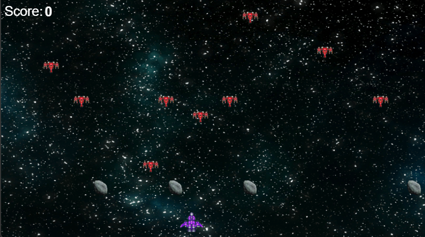
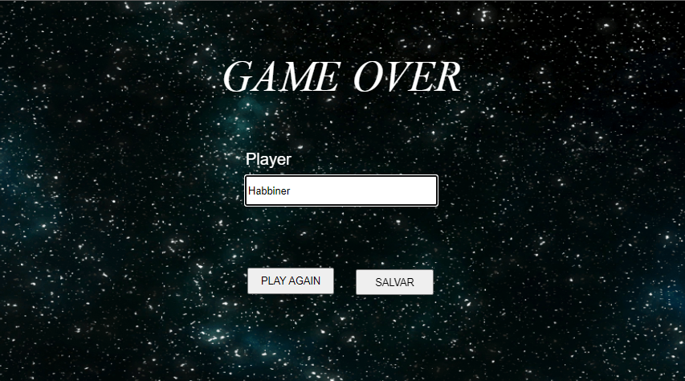

# Game Skywar 🚀

Game desenvolvido no Construct 3 como atividade avaliativa para materia de banco de dados relacional. Onde os objetivos são desenvolver um jogo usando a plataforma Contruct3 e realizar a criação do banco de dados, tabelas, colunas e coneta-la com o jogo para que o histórico de jogadores fique salvo.

# Informações Game 👾

Em Skywar, os jogadores mergulham em uma aventura intergaláctica onde assumem o papel de um piloto corajoso em meio a um universo repleto de perigos e desafios. Pilotando uma nave espacial ágil e poderosa, os jogadores enfrentam uma constante avalanche de naves inimigas que surgem em sua direção, determinadas a impedi-los a todo custo.

Enquanto o caos do combate espacial se desenrola, o jogador é confrontado com a ameaça adicional dos asteroides que vagam pelo espaço, exigindo reflexos rápidos e habilidades de pilotagem precisas para evitar o desastre. Em meio a essa intensa batalha, a icônica música tema de "Star Wars", escolhida meticulosamente por uma amiga especial, ressoa ao fundo, infundindo a atmosfera com uma sensação de grandiosidade e aventura.

Guiados pela determinação e coragem, os jogadores embarcam em uma missão épica para superar as forças do mal e proteger os reinos celestes da tirania. Com ação emocionante e uma trilha sonora arrebatadora, Skywar promete levar os jogadores a uma jornada inesquecível através das estrelas, onde o destino da galáxia está nas mãos dos mais valentes e destemidos.

## Informações Adicionais

- O jogo desenvolvido com Construct 3.

- Banco de dados relacional hospedado no PhpMyAdmin e conexão entre game e banco feita em PHP.

- Hospedagem do game no Netlify.

 

# Mídias do Game 📸

## Tela da Morte  💀

## Gameplay 📹

# Links para sua Gameplay

- Repositório Git: <a href="https://github.com/habbiner/game-skywar" target="_blank">Clique aqui! </a>

- Hospedagem Jogo: <a href="https://skywar-dsm2.netlify.app" target="_blank"> Clique para jogar. </a>

- PhpMyAdmin: <a href="https://www.phpmyadmin.net" target="_blank">https://www.phpmyadmin.net </a>

- 000WebHost: <a href="https://br.000webhost.com" target="_blank">https://br.000webhost.com </a>

- Construct 3: <a href="https://www.construct.net/en" target="_blank">https://www.construct.net/en </a>